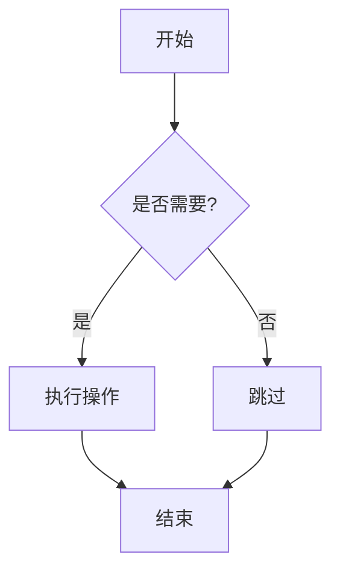
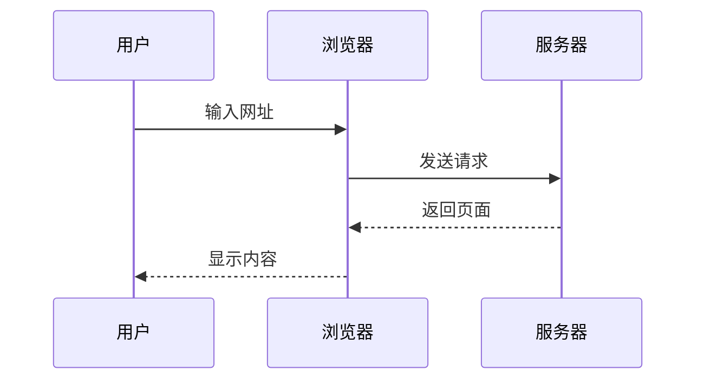
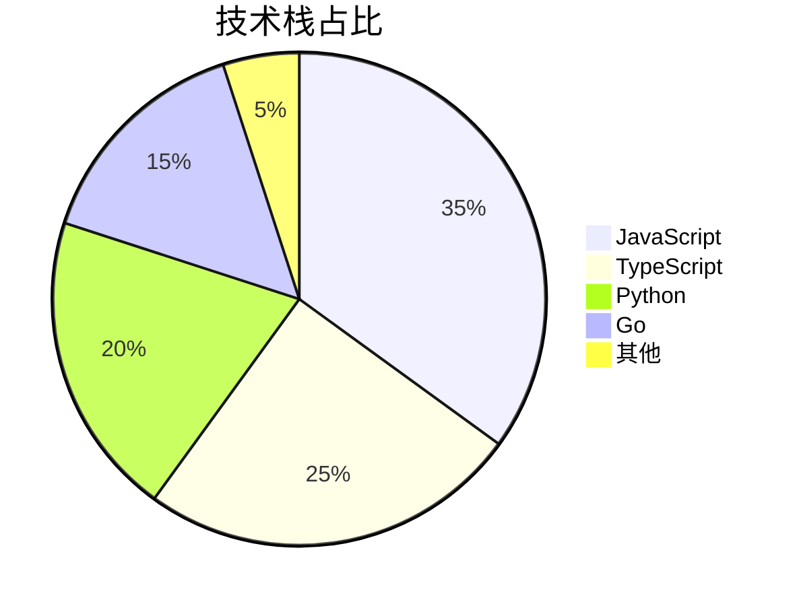
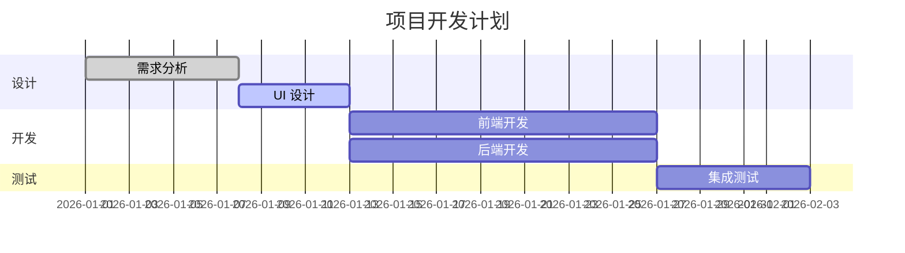

## 前言

写博客、记笔记、写文档，基本都逃不开 Markdown。用简单的符号就能排版出漂亮的文档，比 Word 方便多了，让你专注于内容本身。

这篇教程从基础语法讲起，覆盖进阶用法，还包括本博客（Firefly 主题）的扩展语法。

## 基础语法

### 标题

用 `#` 号创建标题，几个 `#` 就是几级：

```markdown
# 一级标题
## 二级标题
### 三级标题
#### 四级标题
##### 五级标题
###### 六级标题
```

实际效果：

# 一级标题
## 二级标题
### 三级标题
#### 四级标题
##### 五级标题
###### 六级标题

> 一篇文章通常只用一个一级标题（自动生成），正文从二级开始。

### 文本格式

| 语法 | 效果 | 说明 |
|------|------|------|
| `**粗体**` | **粗体** | 双星号 |
| `*斜体*` | *斜体* | 单星号 |
| `***粗斜体***` | ***粗斜体*** | 三星号 |
| `~~删除线~~` | ~~删除线~~ | 双波浪号 |
| `` `行内代码` `` | `行内代码` | 反引号 |

`_` 可以替代 `*`，`__粗体__` = `**粗体**`。

### 链接

语法是 `[链接文字](URL)`：

```markdown
[Google](https://www.google.com)
[带提示的链接](https://www.google.com "鼠标悬停时显示")
```

实际效果：

[Google](https://www.google.com)
[带提示的链接](https://www.google.com "鼠标悬停时显示")

直接写 URL 会自动变成可点击链接。

### 图片

语法是 ``：

```markdown

```

设置大小（部分解析器支持）：

```markdown

```

### 列表

**无序列表**用 `-`、`*` 或 `+` 开头：

```markdown
- 第一项
- 第二项
  - 嵌套项
  - 嵌套项
- 第三项
```

实际效果：

- 第一项
- 第二项
  - 嵌套项
  - 嵌套项
- 第三项

**有序列表**用数字加 `.` 开头：

```markdown
1. 第一步
2. 第二步
3. 第三步
```

实际效果：

1. 第一步
2. 第二步
3. 第三步

> 数字不用严格递增，写 `1. 1. 1.` 也会自动编号为 1、2、3。

**任务列表**用 `- [ ]` 或 `- [x]`：

```markdown
- [ ] 未完成的任务
- [x] 已完成的任务
- [ ] 另一个待办
```

实际效果：

- [ ] 未完成的任务
- [x] 已完成的任务
- [ ] 另一个待办

### 引用

用 `>` 创建引用块：

```markdown
> 这是一段引用文字。
> 可以写多行。
>
> 甚至可以分段。
```

实际效果：

> 这是一段引用文字。
> 可以写多行。
>
> 甚至可以分段。

引用可以嵌套：

```markdown
> 一级引用
>> 二级引用
>>> 三级引用
```

### 分割线

用三个或更多的 `-`、`*` 或 `_` 创建：

```markdown
---
***
___
```

实际效果：

---

***

___

## 进阶语法

### 表格

用 `|` 分隔列，`-` 分隔表头和内容：

```markdown
| 姓名 | 年龄 | 城市 |
|------|------|------|
| 张三 | 25   | 北京 |
| 李四 | 30   | 上海 |
| 王五 | 28   | 广州 |
```

实际效果：

| 姓名 | 年龄 | 城市 |
|------|------|------|
| 张三 | 25   | 北京 |
| 李四 | 30   | 上海 |
| 王五 | 28   | 广州 |

对齐方式用冒号控制：

```markdown
| 左对齐 | 居中对齐 | 右对齐 |
|:-------|:-------:|-------:|
| 左     | 中      | 右     |
```

实际效果：

| 左对齐 | 居中对齐 | 右对齐 |
|:-------|:-------:|-------:|
| 左     | 中      | 右     |

### 代码块

**行内代码**用单个反引号：`` `code` ``

**代码块**用三个反引号，可以指定语言：

````markdown
```python
def hello():
    print("Hello, Markdown!")
```
````

实际效果：

```python
def hello():
    print("Hello, Markdown!")
```

支持 `javascript`、`typescript`、`html`、`css`、`python`、`java`、`go`、`rust`、`bash` 等。

四个空格或一个 Tab 缩进也能创建代码块，但不如反引号方便。

### 链接引用

把 URL 提取出来统一管理，正文更干净：

```markdown
这是一个[长链接][1]，还有[另一个][2]。

[1]: https://www.example.com/very/long/url
[2]: https://www.another.com/url
```

实际效果：

这是一个[长链接][1]，还有[另一个][2]。

[1]: https://www.example.com/very/long/url
[2]: https://www.another.com/url

### 脚注

用 `[^标记]` 创建脚注：

```markdown
这是一个带脚注的例子[^1]。

[^1]: 这是脚注的内容，会显示在页面底部。
```

### 转义字符

用反斜杠 `\` 转义特殊字符：

```
\*这不是斜体\*    →    \*这不是斜体\*
\`这不是代码\`    →    \`这不是代码\`
```

### HTML 混写

Markdown 支持直接嵌入 HTML：

```html
<details>
<summary>点击展开</summary>

这里是折叠的内容，点击后才显示。

</details>
```

实际效果：

<details>
<summary>点击展开</summary>

这里是折叠的内容，点击后才显示。

</details>

## Firefly 扩展语法

以下是 Firefly 主题特有的 Markdown 扩展功能。

### Admonitions（提醒块）

提醒块可以高亮显示重要信息。语法是在引用块 `>` 后面加上类型标记：

```markdown
> [!NOTE]
> 这是一条**注意**信息，用于补充说明。

> [!TIP]
> 这是一个**提示**，给出有用的建议。

> [!IMPORTANT]
> 这是一条**重要**信息，需要特别关注。

> [!WARNING]
> 这是一个**警告**，可能导致问题。

> [!CAUTION]
> 这是一条**危险**操作提醒，请谨慎处理。
```

实际效果：

> [!NOTE]
> 这是一条**注意**信息，用于补充说明。

> [!TIP]
> 这是一个**提示**，给出有用的建议。

> [!IMPORTANT]
> 这是一条**重要**信息，需要特别关注。

> [!WARNING]
> 这是一个**警告**，可能导致问题。

> [!CAUTION]
> 这是一条**危险**操作提醒，请谨慎处理。

也可以自定义标题：

```markdown
> [!NOTE] 自定义标题
> 这条提醒有一个自定义标题。
```

### Mermaid 图表

Mermaid 是一个基于文本的图表工具，用简单语法创建流程图、时序图、甘特图等。代码块指定语言为 `mermaid` 就行：

#### 流程图

````markdown

````

实际效果：


#### 时序图

````markdown

````

实际效果：


#### 饼图

````markdown

````

实际效果：


#### 甘特图

````markdown

````

实际效果：


## 写在最后

Markdown 的核心就是让你专注内容。常用语法就那几种，遇到不会的查一下就行，不用一次全记住。写多了自然就熟了。
